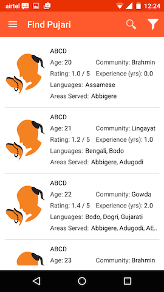
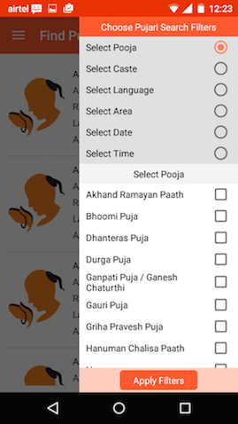
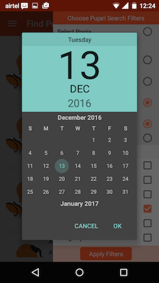
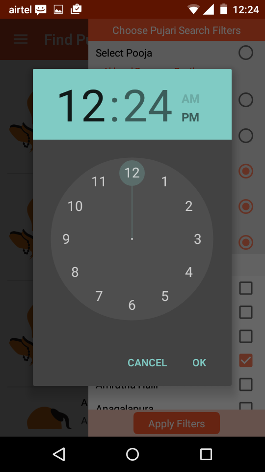
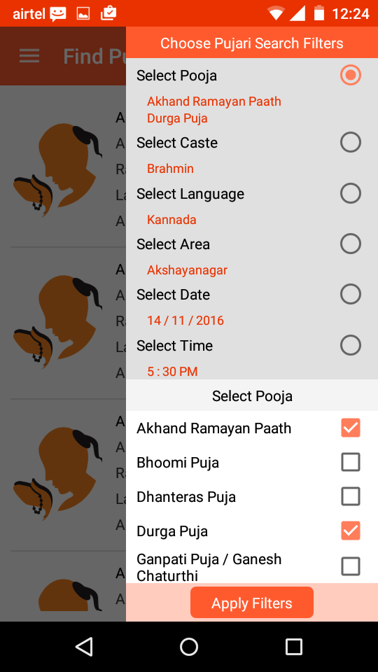

# MyPooja
Android App for ePooja service

This repo contains the codebase for the Android App that I created for my company's eCommerce venture, MyPooja.

Following are some mypoojascreenshots from the MyPooja App.

### Landing Screen

   

### Pujari Listing Screen

### Pujari Filter Drawer

   

   

### Pujari Information Screen

### Pooja List Screens

   
